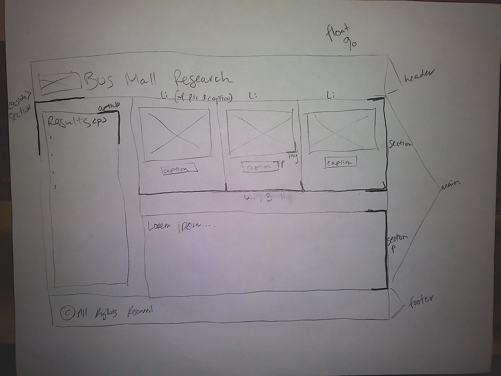

# bus-mall
Code 201 - Week 3 - Lab 11 - *Bus Mall*

### Author
- Tia Low

### Citing additional help from classmates and TAs
- Chance Harmon helped talk through my initial CSS plan
- Skyler Burger helped me with randomizing pictures and making sure none were repeated

### Sources
- Revisited this site for math randomizer reminder: https://developer.mozilla.org/en-US/docs/Web/JavaScript/Reference/Global_Objects/Math/random

### Project Plan & Activity

##### **This project is to create a website for Bus Mall to do market research regarding which products they should include in their publication. They'd like to allow users to click on the product they're interested in, and see a tally of how many times a product was picked and how often it was picked as a percentage of the times it was displayed as an option. They'd like to control the number of rounds the user has the opportunity to choose a favorite. Finally, they'd like to view those results.**

#### Monday, June 15
- Initial file build, followed guidelines for setting up new 201 project
- Initial HTML scaffolding, initial css style for layout of the page
- Issues with the fact that no pictures are shown when user arrives to page
- Used randomizer function to display images from collection of 20
- Revisited rendering to page technique from Salmon Cookies, rendered list of totals to the left side of page

#### Tuesday, June 16
- Had to adjust css so spacing would still work when page size fluctuated
- Discovered some typos I had in rendering images, not correct file paths
- Move function to render images to before randomizer so that images would be on page when user arrives
- Worked through creation of new array in order to make sure no img is displayed two times in a row
- Created chart using canvas element, made bar chart that displays both times clicked and times shown
- Attempted to turn bars into patterns (instead of solid color) but ran into a roadblock, sorted it out in Weds morning code review

#### Weds, June 17
- Today I need to work with local storage to make the data persistently track totals between page refreshes, so I can keep track of aggregate number of votes.

Original lo-fi wireframe:

